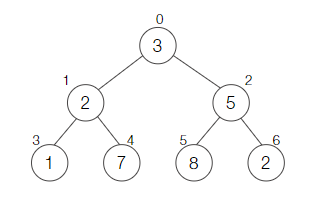
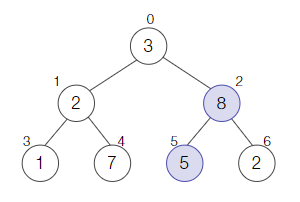
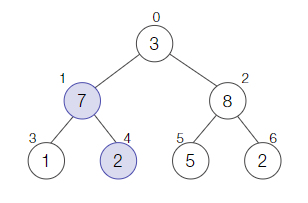
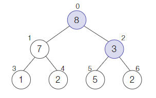

# 최대 힙 구현

arr = [3, 2, 5, 1, 7, 8, 2] 

- index 0의 자식은 index 1, 2
- index 1의 자식은 index 3, 4
- index 2의 자식은 index 5, 6

즉, 노드 i의 왼쪽 자식 노드의 index 는 `(i * 2) + 1`  
노드 i의 오른쪽 자식 노드의 index 는 `(i * 2) + 2`

## 최대 힙 구현 방법

1. 전체 배열의 길이를 반으로 나누기 ex) 7 // 2 = 3
   
    배열 index 3 부터 탐색 시작

2. index 3 
   
   자식이 없으므로 패스

3. index 2 

   자식이 있고, 현재 노드 보다 자식 노드의 값이 높으므로 (5 < 8) index 2와 5의 값 교환

   

4. index 1

   자식이 있고, 현재 노드 보다 높은 자식 노드가 존재하므로 (2 < 7) index 1 과 4 의 값 교환

   

5. index 0

   자식이 있고, 현재 노드 보다 높은 자식 노드가 존재하므로 (3 < 8) index 1 과 4 의 값 교환

   
   
   index 0 까지 비교 후 로직 종료